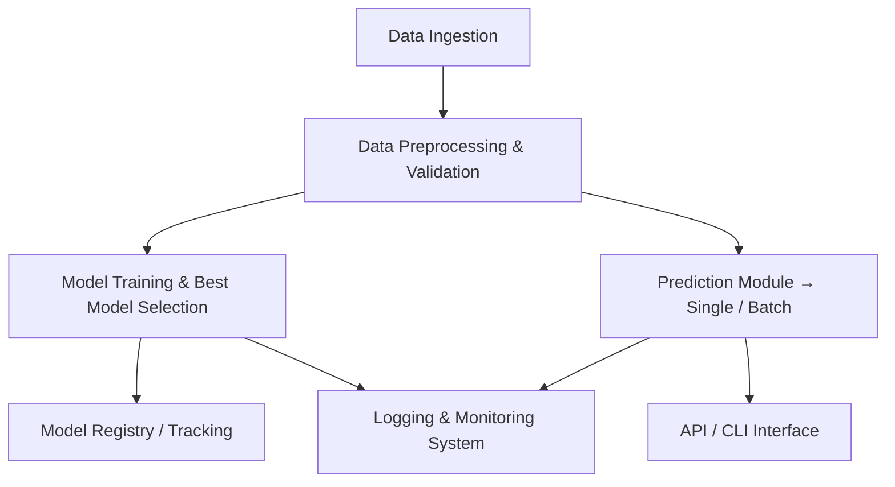

# Fraud Transaction Detection:

A modularized system to detect fraudulent transactions, built with clean architecture and scalable design.

---

## Table of Contents

- [Problem Statement](#problem-statement)  
- [Key Features](#key-features)  
- [Architecture & Process Flow](#architecture--process-flow)  
- [Project Structure](#project-structure)  
- [Technologies Used](#technologies-used)  
- [Installation & Setup](#installation--setup)  
- [Usage](#usage)  
- [Model Training & Prediction Workflow](#model-training--prediction-workflow)  
- [Docker & Deployment](#docker--deployment)  
- [Monitoring & MLOps](#monitoring--mlops)  
- [Contributing](#contributing)  
- [License & Author](#license--author)  

---

## Problem Statement

With increasing digital transactions, detecting fraudulent activity in real time is critical for financial safety. This project aims to determine whether transactions are fraudulent using a modular, scalable pipeline.

---

## Key Features

- **Modular Design**: Organized into components for data ingestion, preprocessing, validation, model training, prediction, and logging.
- **Supports Real-Time & Batch Prediction**: Use for single prediction inputs or batch processing via API or CLI.
- **Model Training Pipeline**: Automates training and selecting the best model version.
- **Monitoring & Logging**: Captures validation logs and tracks model performance.
- **Deployment Friendly**: Can be containerized via Docker and deployed with ease.
- **MLOps Support**: Integrated with DVC and MLflow for experiment tracking and pipeline orchestration.

---

## Architecture & Process Flow



## Project Structure:
```
Fraud-Transation-Detection-Using-Modular-Coding/
├── Application_Logging/
├── Data_Ingestion/
├── Data_Preprocessing/
├── Dataset/
├── File_Operations/
├── best_model_finder/
├── models/                          # Contains saved models (e.g., XGBoost)
├── PredictionArchiveBadData_AdditionalFile/
├── PredictionFileFromDB/
├── Prediction_Batch_Files/
├── Prediction_DataType_Validation/
├── Prediction_Data_Preprocessing_BeforeDB/
├── Prediction_Database/
├── Prediction_Logs/
├── Prediction_Output_File/
├── Prediction_Raw_Data_Validation/
├── TrainingArchiveBadData_AdditionalFile/
├── TrainingFileFromDB/
├── Training_Batch_Files/
├── Training_DataType_Validation/
├── Training_Data_Preprocessing_BeforeDB/
├── Training_Database/
├── Training_Raw_Data_Validation/
├── TrainingModel.py
├── training_validation_insertion.py
├── prediction_validation_insertion.py
├── app.py                          # Flask web app for real-time usage
├── predict_from_model.py
├── requirements.txt
├── runtime.txt
├── Procfile / app.yaml / manifest.yml  # For platform deployments
├── templates/                      # If there’s an HTML interface
├── schema_Training.json
├── schema_Prediction.json
└── assets/                         # Contains visuals like flowchart & UI previews
-----
```

## Technologies Used:
- **Python** – Primary programming language
- **Machine Learning** – XGBoost or equivalen
- **API Framework** – Flask for web interface
- **MLOps Tools** – DVC & MLflow for tracking and experiment management
- **Deployment** – Docker, plus optional Heroku or other cloud platforms
- **Database / Storage** – Optional use of MongoDB or structured files for logs or storage

## 🚀 Installation & Setup

1.  **Clone the repository:**
    ```bash
    git clone [https://github.com/sumeet0701/Fraud-Transation-Detection-Using-Modular-Coding.git](https://github.com/sumeet0701/Fraud-Transation-Detection-Using-Modular-Coding.git)
    cd Fraud-Transation-Detection-Using-Modular-Coding
    ```

2.  **Create your Python environment and install dependencies:**
    ```bash
    conda create -n fraud_env python=3.6.9
    conda activate fraud_env
    pip install -r requirements.txt
    ```

---

## 💻 Usage

### Single Transaction Prediction

Run the `app.py` script to get a prediction for a single transaction via a web API.
```bash
python app.py
```

### For Batch Process:
For large datasets, use the predict_from_model.py script for batch predictions.
```bash
python predict_from_model.py --input_file path/to/data.csv --output_file path/to/predictions.csv
```
## Model Training & Prediction Workflow
- **Training Model**: Run ```TrainingModel.py``` to preprocess, train, and select the best model.
- **Model Tracking**: Use DVC and MLflow to version and monitor models.
- **Prediction:** Uses ```predict_from_model.py``` for batch predictions, or the API via ```app.py```.

-------

## Docker & Deployment
### Docker:
```bash

FROM python:3.9-slim
WORKDIR /app
COPY . .
RUN pip install -r requirements.txt
EXPOSE 5000
CMD ["python", "app.py"]
```
### Deploy:
Build and run locally:
```bash
docker build -t fraud-detector .
docker run -p 5000:5000 fraud-detector
```
- Suitable for deployment to platforms like Heroku, GCP, AWS, etc.

## Monitoring & MLOps
- Flask Monitoring Dashboard: Optional UI to inspect API performance.
- Logging: Stored in Prediction_Logs/ and Training_Logs/.
- Model Registry: Use MLflow to compare versions and performance metrics.

## Contributing
- Fork the repo
  -- Create a feature branch: git checkout -b feature/YourFeature
  -- Commit your changes: git commit -m "Add new feature"
  -- Push and open a Pull Request

## License & Author

License: MIT License (see LICENSE file)

Author: @Maheshwari Sumeet
